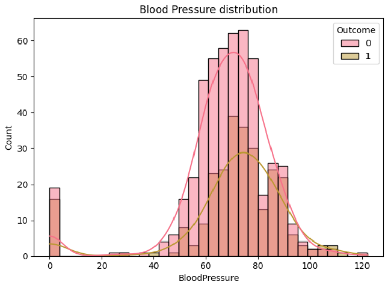

# Diabetes-Prediction-Model
This machine learning model predicts if a patient is diabetic or not with accuracy of 76.9%. The model takes the following nine measurements to make decision on the diabetes status of patients: Pregnancies, Glucose, BloodPressure, SkinThickness, Insulin, BMI, DiabetesPedigreeFunction, and Age.

## Explortary Data Analysis (EDA) and Visualization
The dataset used to train the model has 768 records, each with the aforementioned fields, and a target field (Outcome).

### Last and first five patients in the dataset

### Data Summary
The data summary as below with different measures of dispersion for each field. These measures are: count, mean, standard deviation (std), minimum (min), maximum (max), and quartiles (upper, middle, lower). However, some columns have medically unrealistic values. Such unrealistic values are replaced with column median or mean, whichever gives realistic value.

### Fields with missing values

There are no missing measurements in the dataset.

### Visualizing how many people have diabetes vs not

From the distribution, the data is imbalanced and this can result to poor performance.

### Correlation between different measurements

As evident in the correlation graph, there is no negative correlation between the target and feature measurements. With Glucose, BMI, Age, and Pregnancies measurements having stronger influence on the outcome, in decreasing order.

### glucose levels between groups comparison using boxplot

The boxplot shows that diabetic group has glucose levels ranging approximately from 123 to 160 whereas non-diabetic from 90 to 125.

### BMI levels between groups comparison using violinplot

The violinplot for the Diabetes group is wider at higher BMI values compared to the group with No Diabetes, especially around the 40-50 BMI range. This suggests that a larger number of individuals with diabetes have a higher BMI.

### Measurement Distributions

Most of the people living without diabetes have ages between 20 to 40 years. There are more old people with diabetes than young.

## Data Preparation and Preprocessing
In the phase, i replaced all unrealistic values with real ones. As observed from the class distribution, the dataset contains 268 diabetic records and 500 non-diabetic. To avoid a biased model, i undersampled the majority class, using RandomUnderSampler python library. 

Additionally, to ensure measurements are all on a similar scales, i standardized the dataset using StandardScaler library.

## Training the Model
I created a model using RandomForestClassifier algorithm. I decided to go for this algorithm because it is an ensemble method that combines multiple decision trees to produce a more accurate and stable prediction. The algorithm would also help me rank and figure out the importance and influence of each measurement field in the data.

## Model Performance Evaluation
The model shows fair test accuracy of 77% and training accuracy of 86%.

## Feature Importance 

From the chart, Glucose, BMI and Age contribute the most in the prediction.

